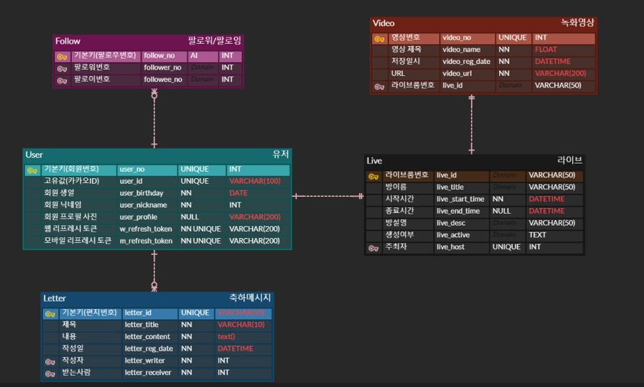
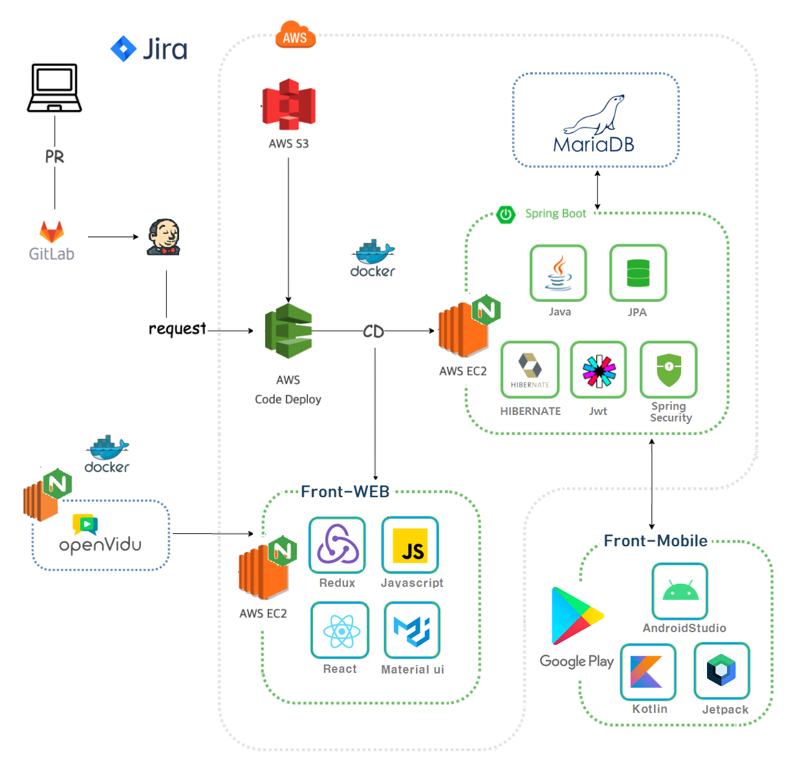

# Partylog
생일(기념일)에 초점을 맞춘 SNS형 메시징, 영상회의 서비스

# 관련 자료

### ERD
별도의 DB 서버 운영, JPA를 활용한 DB연결

### 기술스택

# 핵심 기능 소개

### 유저 
- OAuth 2.0을 사용한 카카오톡 소셜 로그인
- JWT 토큰 기반 인증, 인가
- AWS S3를 사용한 이미지 저장
- 유저간 팔로우 기능.

### 메시지 기능 
- 기념일 당일 열람가능한 메시지.

### 영상 기능
- Openvidu Api를 활용한 N:N 화상 회의 구현 
- Ubuntu 환경 내 영상 저장.

### 배포
- Doker/Jenkins 기반의 CI/CD 파이프라인 구축
- SSL 인증서를 통한 https 적용
