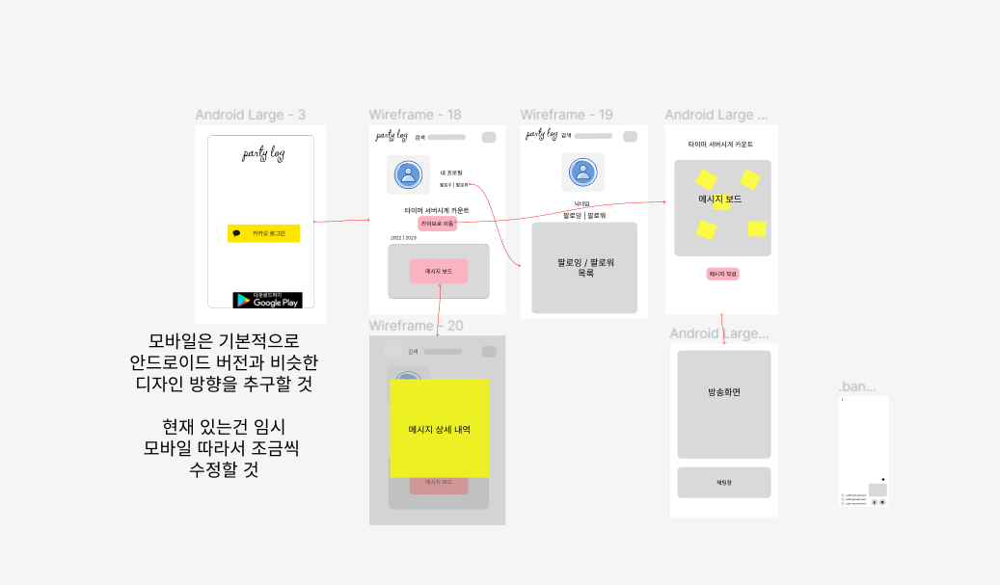

### Web README

1. **기획의도**
   저희 서비스는 바쁜 일상 속에서 지인의 생일을 간단하게, 하지만 성의있게 축하해주자는
   취지에서 기획되었습니다.

로그인 후 친구찾기 기능을 통해 다른 유저들을 검색하여 팔로우할 수 있고 그 친구의 페이지로
이동하여 친구에게 메시지를 남길 수 있습니다. 또한 얼굴을 보며 축하해주고 싶은 경우 친구의
라이브 방송 페이지로 이동하여 얼굴을 보며 다른 친구들과 함께 축하해줄 수 있습니다.

2.  **피그마 UI 디자인**





와이어프레임에서 기본적인 흐름과 기능,버튼의 위치 등을 정하고
디자인을 확정하여 목업을 만들었습니다. 그 뒤 실제 개발 화면을 캡쳐해가며
목업 대비 진행상황을 점검하며 진행하였습니다.

3. **반응형 웹 페이지**
   저희는 웹 페이지의 디자인에서 반응형에 주의를 기울여 크기에 따라 자연스럽게 볍화된 화면이 보이도록 구성하였습니다.


유저페이지에서 메시지 보드와 표시되는 메시지의 수와 크기를 세심한 주의를 기울여
반응형으로 디자인하였습니다.


친구페이지에 표시되는 팔로잉 팔로워 목록 역시 반응형으로 디자인하였습니다.

4. **로고 변천사**
   처음엔 ai로 로고를 생성해주는 사이트를 통해 만든 로고를 사용하려고 하였으나
   
   퍼스널 컬러와의 통일성이나 웹페이지에서 봤을 때의 크기나 가시성 등을 고려하여
   보다 간결한 디자인이면서 색도 보다 저희의 퍼스널 컬러에 맞는 것으로 변경하였습니다.
   
   
   또한 로고 디자인을 정한 후에도 편지모양 로고와 글자 로고를 합쳐서 보여줄 지
   따로 보여줄지를 고민해본 결과 상단 내비 바에선 반응형으로 페이지 크기에 따라
   각각을 보여주고 로딩 페이지에는 합쳐진 이미지를 보여주는 것으로 정하였습니다.
   

5. **트리 구조**

```
React
├─ .env.local
├─ .env.production
├─ .gitignore
├─ Dockerfile
├─ nginx
│  └─ nginx.conf
├─ package-lock.json
├─ package.json
├─ public
│  ├─ favicon.ico
│  ├─ icon6.png
│  ├─ icon6_192.png
│  ├─ index.html
│  ├─ manifest.json
│  └─ robots.txt
├─ README.md
└─ src
  ├─ actions
  │  ├─ actions.js
  │  └─ actionTypes.js
  ├─ App.js
  ├─ App.test.js
  ├─ assets
  │  ├─ Cake.png
  │  ├─ clap
  │  │  └─ clap2.wav
  │  ├─ Frame_21.png
  │  ├─ googleplay.png
  │  ├─ icon.png
  │  ├─ icon2.png
  │  ├─ icon3.png
  │  ├─ icon5.png
  │  ├─ icon6.png
  │  ├─ kakao_login.svg
  │  ├─ kakao_login_large_narrow.png
  │  ├─ LOGO3.png
  │  ├─ molru.webp
  │  ├─ music
  │  │  ├─ birthday1.mp3
  │  │  └─ birthday3.mp3
  │  ├─ Sticky-Note-01-Yellow.png
  │  ├─ Sticky-Note-02-Green.png
  │  ├─ Sticky-Note-02-Pink.png
  │  ├─ Sticky-Note-03-Orange.png
  │  ├─ Sticky-Note-04-Purple.png
  │  └─ TempBg.png
  ├─ components
  │  ├─ firework.jsx
  │  ├─ firework2.jsx
  │  ├─ firework3.jsx
  │  ├─ FollowTabs.jsx
  │  ├─ KakaoCallback.jsx
  │  ├─ LivePage
  │  │  ├─ BrithdayMusic.jsx
  │  │  ├─ ButtonGroups.jsx
  │  │  ├─ ChatBox.jsx
  │  │  ├─ ClapEmoji.jsx
  │  │  ├─ HappyFace.jsx
  │  │  ├─ JoinCheck.jsx
  │  │  └─ ViewersCarousel.jsx
  │  ├─ Loading.jsx
  │  ├─ MessageBoard.jsx
  │  ├─ MessageBoard_Before.jsx
  │  ├─ MessageDetail.jsx
  │  ├─ MessageDetailText.jsx
  │  ├─ MessageModal.jsx
  │  ├─ MessageOnBoard.jsx
  │  ├─ ModalText.jsx
  │  ├─ NavBar.jsx
  │  ├─ openvidu
  │  │  ├─ OvVideo.js
  │  │  ├─ UserVideo.css
  │  │  └─ UserVideoComponent.js
  │  ├─ Route
  │  │  └─ PrivateRoute.jsx
  │  ├─ SearchFriend.jsx
  │  ├─ StickyNote
  │  │  ├─ StickyNoteG.jsx
  │  │  ├─ StickyNoteO.jsx
  │  │  ├─ StickyNotePink.jsx
  │  │  ├─ StickyNotePurple.jsx
  │  │  └─ StickyNoteY.jsx
  │  ├─ Timmer.jsx
  │  ├─ UserFollowButton.jsx
  │  └─ YearChip.jsx
  ├─ css
  │  ├─ BirthdayInput.css
  │  ├─ ClapEmoji.css
  │  ├─ FollowTabsStyles.css
  │  ├─ GlobalFont.css
  │  ├─ LogInPage.css
  │  ├─ MemoBoard.css
  │  ├─ Openvidu.css
  │  └─ UserPage.css
  ├─ fonts
  │  └─ Nikumaru.otf
  ├─ index.js
  ├─ pages
  │  ├─ BirthdayInput.jsx
  │  ├─ LivePage.jsx
  │  ├─ LogInPage.jsx
  │  ├─ LogInPage_Dark.jsx
  │  ├─ MyFriend.jsx
  │  ├─ NotFound404.jsx
  │  ├─ ProfileSetting.jsx
  │  └─ UserPage.jsx
  ├─ reducers
  │  ├─ authReducer.js
  │  ├─ messagesDataReducer.js
  │  ├─ modalDataReducer.js
  │  └─ rootReducer.js
  ├─ reportWebVitals.js
  ├─ setupTests.js
  └─ store
     └─ store.js


```

6. **리덕스**

로그인과 메시지 작성에서 사용하고 있습니다. 로그인의 상태를 관리하는 기능과 메시지의 CRUD와 관련된 역할을 수행합니다.
